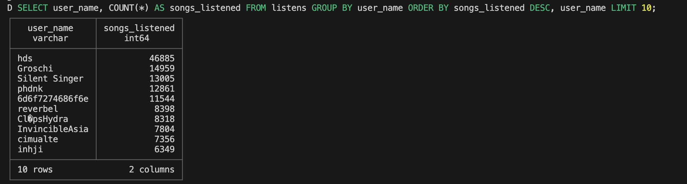
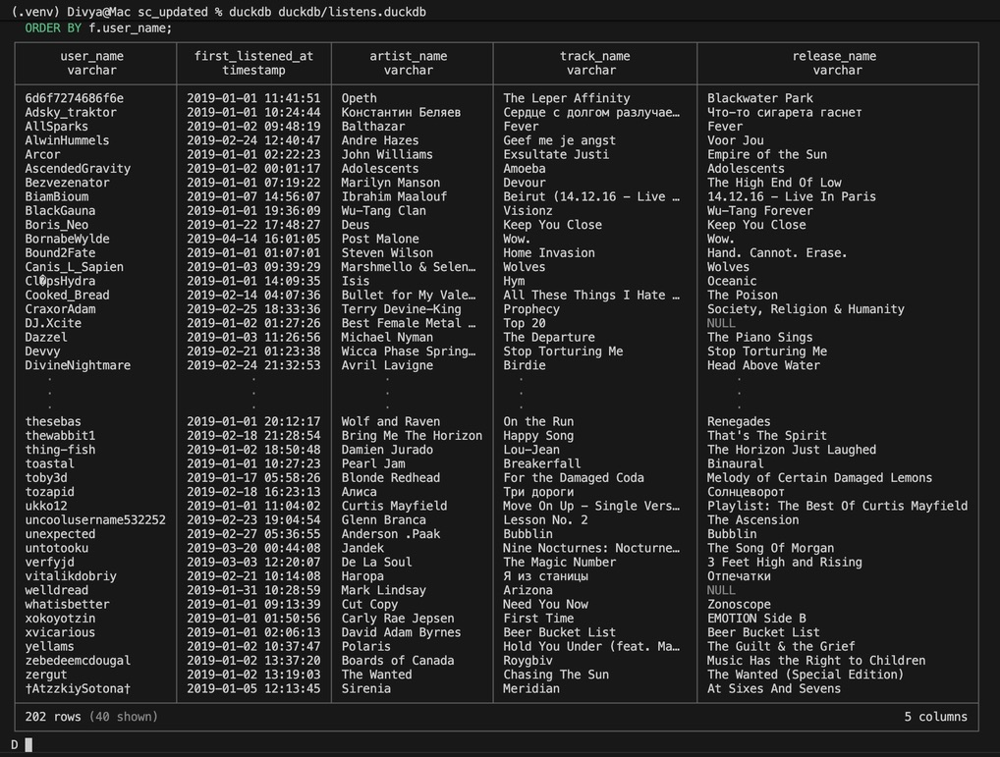
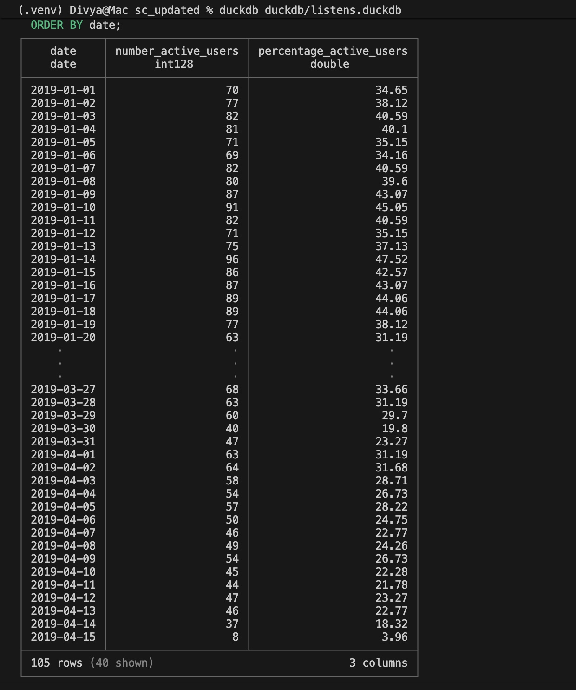

# Task 2 — Data Analysis (SQL)

## Top users by listens

```sql
SELECT user_name, COUNT(*) AS songs_listened
FROM listens
GROUP BY user_name
ORDER BY songs_listened DESC, user_name
LIMIT 10;
```

Example screenshot markdown:



---

## Active users on a specific date

```sql
SELECT COUNT(DISTINCT user_name)
FROM listens
WHERE CAST(listened_at_ts AS DATE) = '2019-03-01';
```

Screenshot placeholder:


---

## First listen per user

```sql
SELECT
  f.user_name,
  f.listened_at_ts AS first_listened_at,
  d.artist_name,
  d.track_name,
  d.release_name
FROM listens f
JOIN track d
  ON d.track_key = f.track_key
WHERE f.listened_at_ts IS NOT NULL
QUALIFY
  ROW_NUMBER() OVER (
    PARTITION BY f.user_name
    ORDER BY f.listened_at_ts ASC, f.listen_id ASC
  ) = 1
ORDER BY f.user_name;
```

Screenshot placeholder:



---

## Top 3 dates per user

```sql
SELECT
  user_name AS "user",
  COUNT(*) AS number_of_listens,
  DATE(listened_at_ts) AS "date"
FROM listens
GROUP BY
  user_name,
  DATE(listened_at_ts)
QUALIFY
  ROW_NUMBER() OVER (
    PARTITION BY user_name
    ORDER BY COUNT(*) DESC, DATE(listened_at_ts) ASC
  ) <= 3
ORDER BY
  "user" ASC,
  number_of_listens DESC,
  "date" ASC;
```

Screenshot placeholder:


---

## Daily active users (DAU) and active user rate (%)

```sql
WITH all_users AS (
  SELECT COUNT(DISTINCT user_name) AS total_users
  FROM listens
  WHERE listened_at_ts IS NOT NULL
),
daily_flags AS (
  SELECT
    DATE(listened_at_ts) AS date,
    user_name,
    1 AS listened
  FROM listens
  WHERE listened_at_ts IS NOT NULL
  GROUP BY 1, 2
),
active_per_day AS (
  SELECT
    date,
    user_name,
    MAX(listened) OVER (
      PARTITION BY user_name
      ORDER BY date
      RANGE BETWEEN INTERVAL 6 DAY PRECEDING AND CURRENT ROW
    ) AS is_active
  FROM daily_flags
)
SELECT
  date,
  SUM(is_active) AS number_active_users,
  ROUND(100.0 * SUM(is_active) / au.total_users, 2) AS percentage_active_users
FROM active_per_day
CROSS JOIN all_users au
GROUP BY date, au.total_users
ORDER BY date;
```

Screenshot placeholder:



---
